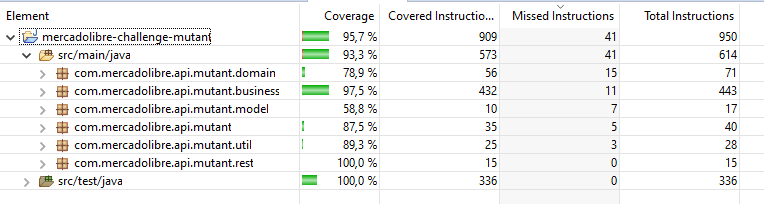

# mercadolibre-challenge-mutant

Challenge propuesto para Back-end el cual consiste en crear una API REST para detercar si un humano es mutante a partir de su ADN

## Tecnologias
* Java 11
* Spring
* Gradle
* MySql


## ENDPOINTS para pruebas

- [Swagger documentación](http://ec2-3-94-143-75.compute-1.amazonaws.com/swagger-ui.html)
- [Servicio validador de ADN](http://ec2-3-94-143-75.compute-1.amazonaws.com/mutants/)
- [Servicio estadisticas](http://ec2-3-94-143-75.compute-1.amazonaws.com/stats)

## Uso
### Es mutante

Request: 
- POST http://ec2-3-94-143-75.compute-1.amazonaws.com/mutants/

Request body (caso ADN mutante):

```
  {"dna":["ATGCGA", "CAGGGC", "TTATGT", "AGAAGG", "CCCCTA", "TCACTG"]}
```

Response:

```
  200 OK
```

Request body (caso ADN humano):

```
  {"dna":["AATACT", "CCCAGA", "GGGATT", "AATTCC", "GGATCG", "TCACTG"]}
```

Response:

```
  403 Forbidden
```


Request body (caso ADN invalido):

```
  {"dna":["AATACT", "CCCAGA", "GGGATT", "AATTCC", "TCACT"]}
```

Response:

```
  403 Forbidden [mensaje de error]
```

### Estadisticas

Request: 
- GET http://ec2-3-94-143-75.compute-1.amazonaws.com/stats

Response: 200 (application/json)

```
{
    count_mutant_dna: 4,
    count_human_dna: 1,
    ratio: 0.8
}
```

#### Nota

- Los casos de ADN invalido no se toman en cuenta para las estadisticas

### Test

Para la ejecucion de los test automaticos utilice jUnit 5.
Los test se pueden ejecutar utilizando el comando:

```
gradle test
```

#### Cobertura de codigo

Para validar la cobertura utilice el plugin Java Code Coverage de eclipce



### Ejecutar en local

Para correr el programa en local podemos utilizar los siguientes comandos:

```
gradle run
```

Por defecto la aplicacion se va a conectar a la base de datos alojada en RDS, para conectarla a una base de datos en local es necesario ejecutar el programa en perfil de dev ademas de tener corriendo una instancia de MySQl en la maquina, configurar los datos de conexión deses src\main\resources\application-dev.yml
y ejecutar el esquema de base de datos, los scripts de este se encuentran en la carpeta DB\


### - [Mauricio Valencia Cosme](mauro.valc@gmail.com)
